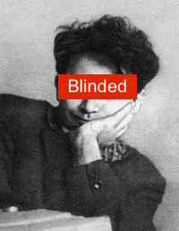
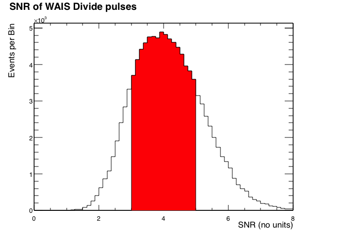
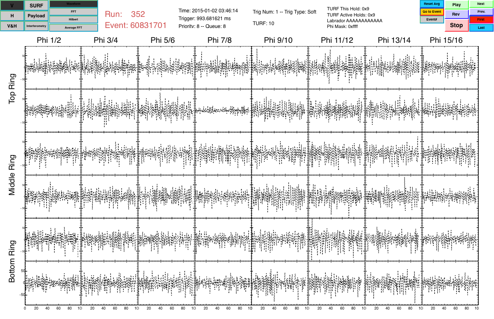
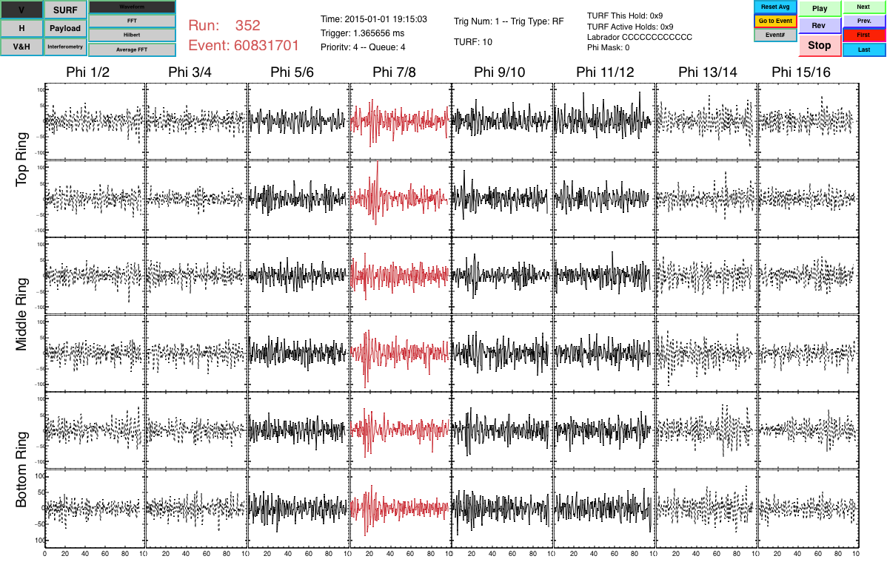

# Blinding the ANITA-3 analysis

A how to guide for blinding the ANITA analysis in 5 easy steps.

### Episode 2: the blinding strikes back
- Unblinding my analysis revealed some weaknesses in my analysis I hope to address the second time around.
- The main limitation was not being matching the peak direction closely enough with un-masked directions in the overwritten header events.
- So this time I:
    - find the peak direction of the events I will insert.
	- then look at the offline phi-masking in V and H and avoid inserting if they are close.
	- Reconstruct the event and check it reconstructs to somewhere on the continent.

-   HPol analysis
-   Cosmic rays channel, no new physics
-   Insert **0** events - **Unblinded**

-   VPol analysis
-   Potential neutrino discovery channel
-   Insert **~10** events - **Blinded**

## Step 1 - Select N ~ 10 event to overwrite

-   `N = TRandom3::uniform(10, 15)`
-   Have 78,630,529 events in runs 130-439
    -   With 1,813,681 minimum bias (MB) triggers (Soft/ADU5/G12).
-   Split MB events up into `N` sections with `L = 1813681/N` events
-   Select the `TRandom3::uniform(0, 1813681)` the MB event.
    -   Add MB `eventNumber` to `anita3OverwrittenEventInfo.txt`
    -   Also add unique index between 0 - 50 (index of fakeTrees)
-   These are the **events to be overwritten**

## Step 2 - Select small-medium size WAIS pulses

-   WAIS pulses binned in SNR
-   70,231 (out of 118,472) in the range 3 < SNR < 5

## Step 3 - Select 50 of these pulses

-   Select 50 of these pulses
-   These become **fake events**
    -   `fakeEventTree.root`
        -   `UsefulAnitaEvent` swapped polarisation data
        -   Also filtered ALFA channel
    -   `fakeHeadTree.root`
        -   `RawAnitaHeader` with swapped polarisation info

## Step 4. Modify AnitaEventCalibrator

-   New function `loadCalib()`
    -   Reads in `fakeEventTree` and `anita3OverwrittenEventInfo.txt`
    -   Set internal `UsefulAnitaEvent* fFakeEvent` to branch in `fakeEventTree`
-   Insert layer into `UsefuAnitaEvent::calibrateUsefulEvent()` routine
    -   Checks `eventNumber` against `anita3OverwrittenEventInfo.txt`
        -   If matches swap out for `fFakeEvent`
        -   Retain `eventNumber` and `surfEventId[12]`
-   Now on GitHub `eventReaderRoot` (anita3 branch)
    -   <https://github.com/anitaNeutrino/eventReaderRoot/tree/anita3>
    -   Post a message in the Slack **github\_commits** group if you need help setting up

## Step 5. Make Blind Header Trees

-   Read data from `anita3OverwrittenEventInfo.txt`
-   Create new header file
    -   Copy all non-matching headers
    -   Swap headers with `eventNumbers` with corresponding entry in `fakeHeadTree`.
    -   Retain `eventNumber`, `run`, `turfEventId`.
-   For run `X` now have `blindHeadFileV1_X.root`.
    -   V1 is version 1.
    -   Can increment if need to reblind analysis.

## Example Event - Before Blinding

-   Unblinded first event in run 352

## Example Event - After Blinding

-   Blinded first event in run 352 (Note: VPol selected in `MagicDisplay`)

## Example - After Blinding

-   Confirm reconstruction works with swapped polarisaton

## Summary: How to blind your analysis

-   Update to `eventReaderRoot` anita3 branch on GitHub
    -   contains `anita3OverwrittenEventInfo.txt` **DON'T LOOK AT THIS**
    -   contains `fakeEventFile.root, fakeHeadFile.root` files
-   New header files
    -   Moved headFileX.root -> headFileX.blind.root
    -   New file blindHeadFileV1\_X.root
        -   Symbolic link headFileX.root to blindHeadFileV1\_X.root ?
    -   New stuff available here:
        <https://www.hep.ucl.ac.uk/uhen/anita/private/anita3/flight1415/root/>

-   Code used to generate blinding files here:
    <https://github.com/strutt/blindingSetup>
